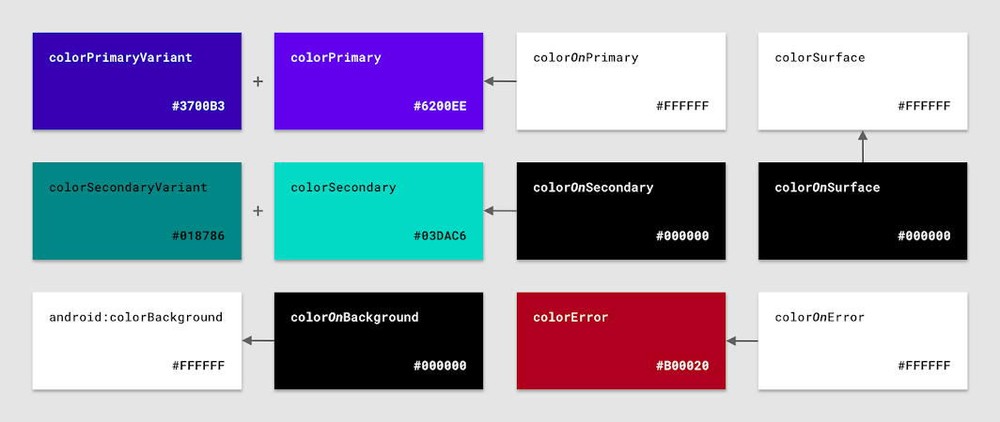

# Intro

# 1. Color naming 
First of all, we have to select our colors. As far as in Android Studio 4.0.1 if you create a new project with the empty activity wizard, the colors file looks like this.

```xml
<resources>
  <color name="colorPrimary">#6200EE</color>
  <color name="colorPrimaryDark">#3700B3</color>
  <color name="colorAccent">#03DAC5</color>
</resources>
```

As it is recommended the colors should have literal names (describe the value not how it's used). 
You can find how to name colors [here](), use the [Material colors guide](), use a Plugin like [this one]() or a mix of all of them.

```xml
<resources>
  <color name="brandPink">#880033</color>
  <color name="brandPinkDark">#66003c</color>
  <color name="brandGreen">#009933</color>
  <color name="brandGreenDark">#007700</color>
  <color name="brandWhite">#DCDCDC</color>
  <color name="brandBlack">#090909</color>
</resources>
```  

Now that we have our colors  we have to set them in our theme attributes.

> You can learn about theme attributes in my previous post in the section [Theme attrs in less than 100 words.]
  

# 2. Color theme attributes

An image is worth 1000 words.



Here we can see the 12 attributes that the Material Design Library offer us.

```
colorPrimary
colorPrimaryVariant
colorOnPrimary

colorSecondary
colorSecondaryVariant
colorOnSecondary

android:colorBackground
colorOnBackground

colorSurface
colorOnSurface

colorError
colorOnError

```

As you can see the colors attributes are divided in some colors like `colorPrimary`, and in how should the foregound of that color be like `colorOnPrimary`.


This is very helpfull because we have now one place where we define our colors and also how the foreground of that color is, so we know that there wont be visibility problems, like if a dark colored button has dark colored text.
There is a relation btween primary/varinat and/ on. If you change one check the others 

Between `main` ,`variant`  and `on`  colors  there is a link. Overriding one means you need to check the others 2.

# 3 Update your theme with your colors
Now that we have our colors set lets apply them to our Theme.

First of all and form Androdis Studio 4.0.1 the Empty Activity wizard creates  this style
```xml
<resources>
  <!-- Base application theme. -->
  <style name="AppTheme" parent="Theme.AppCompat.Light.DarkActionBar">
    <!-- Customize your theme here. -->
    <item name="colorPrimary">@color/colorPrimary</item>
    <item name="colorPrimaryDark">@color/colorPrimaryDark</item>
    <item name="colorAccent">@color/colorAccent</item>
  </style>

</resources>
```

Lets clean this up.

First, make the parent to inherit from a MD theme aike `Theme.MaterialComponents.DayNight.NoActionBar` 
> For that first add the libray `com.google.android.material:material:1.2.1` in your gradle module file.

Second, change the name to reflect that it is a theme. 

`values/themes.xml`
```xml
  <style name="Theme.MyApp" parent="Theme.MaterialComponents.DayNight.NoActionBar">
    <item name="colorPrimary">@color/brandPink</item>
    <item name="colorPrimaryVariant">@color/brandPinkDark</item>
    <item name="colorSecondary">@color/brandGreen</item>
    <item name="colorSecondaryVariant">@color/brandGreenDark</item>
  </style>
    
```

Finally and most important move it to a `themes.xml` file.

## Note about naming and file system: 
### Naming
For Themes and Widget Styles the convention is:

 * Use `Theme.YourAppsName.ThemeVariantName` for the themes 
 * Use `Widget.YourAppsName.WidgetType.WidgetVariantName` for the widget 
 * Themes will be set for a `theme` in a xml.
 * Widgets will be set for a `stlyle` in a xml.
 With this it is easy to see that we are not missuing themes and widgets.

You won't need to change all of them. Start changing only the Primary and Secondary and their cousins (variant and on). The rest will most of the time do the job.

### Files
* Add your themes in `themes.xml` file
* Add your widget styles in `styles.xml` file
* Add your colors in `xyz.xml` file
* Add your typographies in `type.xml` file

Now if we run our app we can see how the colors are applied as the theme determine.

# 4 Widgets and default attributes.
Let's see how the widgets aslo aplyed the theme we just created.

You might be tempted to create a style for the buttons with you `attr/colorPrimary` and `attr/colorOnPrimary`. Don't do that
```xml
Sample of a style with button and colorPrimary etc.
```

Android Systyem and MD will do all for you.

MD website has been recenlty updated with all the information about theme attributes so now is very easy to understand and modify how them work.

For example The button colors is set to primary and onPrimary so you don't have to do nothnig. 

There are couple of places where this can be more complicated that it looks like, but for most places you wont have problems.

# 5 DarkMode
To test the DarkMode we can simple test how it look like as a far as know.

Copy Paste this and check it out
```kotlin

```

It does not look good because as we can

We need just to create another thme inherinitn most of the Base theme and change our primary...


# 6 What if 12 attributes are not enough
One of the power of theming is the avility to change the full UI styles easily. You can have 2 themes for for example normal and premium users.
The primary color is different for both, just creating a  new theme with the differnt primary color will be enough and and just chaning the theme for each ot the user types will be sufficient.

But image that our design team does not want that the FAB buttons color change. In that case and becasue FAB buttons use color primary attribute to tint it we need a solution.

In that case is very easy, we can define a custom theme attribute that will be used to tint the fab buttons, instead XXX attribute.

```xml
<!-- In res/values/attrs.xml -->
<attr name="fabColor" format="color" />

<!-- In res/values/themes.xml -->
<style name="Theme.App" parent="Theme.MaterialComponents.*">
    <item name="fabColor">?:attr/secondary</item>
</style>

<style name="Theme.App.Premium" parent="Theme.MaterialComponents.*">
    <item name="fabColor">@color/orangePremium</item>
</style>
``` 

> Check it in the companion app

# Extra points
## Colors with alpha
Instead of 
`<color name=”navy_700_alpha_60”>#9937596D</color>`
With this solution we are breakig the power of theming. If we change our color primary to stop being `navy_700` `#993759` we will need to rewrite this.
Or for the premium theme.

Instead use a color sate list that reference the primary colors like:

`res/color/primary_60.xml`
```xml
<selector>
    <item android:alpha="0.6" android:color="?attr/colorPrimary" />
</selector>
```

Becasue we ar epointing to the theme attribute for future changes or in app theme change normal to premium we wont need to change nothing. 

## Theme overlays
Already mentioned in my prevous post, but because is so powerful lets explain it again.
**What are deafault styles?**
>When applying theme overlays in XML, there are two options to consider:
android:theme: Works with all widgets, doesn’t work in default styles
app:materialThemeOverlay: Only works with MDC widgets, works in default styles`


# MDC Widgtes : Other post
## Custom Widgets

# Use a Base Theme

#NOTES
`colorPrimaryDark` is neccesary to tint the status bar