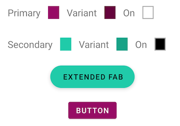

# Intro
This is a continuation to the Article [theming](). I will refer to some section of it.

I will follow a similar structure. Because Theming is a large topic in this article I will focus on **Color**.

* We will see first how to proper name colors.
* Then we will see the most important theme attribute for color.
* After that we will see how the widgets behave with the theme colors.
* Later on we will apply different themes to our app.
* And finally we will see some extra points that can help our daily bassis.

# 1. Color naming 
First of all, we have to select our colors. As far as in Android Studio 4.0.1 if you create a new project with the empty activity wizard, the colors file looks like this.  We should change it.

```xml
<resources>
  <color name="colorPrimary">#6200EE</color>
  <color name="colorPrimaryDark">#3700B3</color>
  <color name="colorAccent">#03DAC5</color>
</resources>
```

As it is recommended the colors should have literal names (describe the value not how it's used). 
To help you with color naming you can use the [Material colors style](https://gist.github.com/HugoMatilla/fc24990505b9da2d081f7a7f87e3424e), use a tool like [name-that-color](https://chir.ag/projects/name-that-color/#D80E9E) or a Plugin like [this one](https://plugins.jetbrains.com/plugin/10422-name-that-color).

In this article I will use these names

```xml
<resources>
  <color name="brandPink">#990066</color>
  <color name="brandPinkDark">#66003c</color>
  <color name="brandGreen">#00CCAA</color>
  <color name="brandGreenDark">#02A287</color>
</resources>
```  

Now that we have our colors  we have to set them in our theme attributes.

> You can learn about theme attributes in my previous post in the section [Theme attibutesrs in less than 100 words.](https://github.com/HugoMatilla/Android-Design-System-and-Theming-Typography/blob/master/readme.md#theme-attributes-vs-view-attributes-in-less-than-100-words)
  

# 2. Color theme attributes

An image is worth 1000 words.


Here we can see the 12 most important color attributes that the Material Design Library offers us.

```
colorPrimary
colorPrimaryVariant
colorOnPrimary

colorSecondary
colorSecondaryVariant
colorOnSecondary

android:colorBackground
colorOnBackground

colorSurface
colorOnSurface

colorError
colorOnError

```

> When creating your Theme you don't need to change all of them. Start changing only the Primary and Secondary and their cousins (`variant` and `on`). The rest  of the attributes will, most of the time, do the job.

As you can see the color attributes are divided in some colors like `colorPrimary`, and in how should the foreground of that color be like `colorOnPrimary`.




This is very helpful because we have now one place where we define our colors and also how the foreground of that color is, so we know that there won't be visibility problems, like if a dark colored button has dark colored text.

> There is an intrinsic relation between `primary`, `variant` and `on`. If you change one of them you should verify that all keep looking good between each other.


# 3. Update your theme with your colors
Now that we have our colors set lets apply them to our Theme.

First of all and form Androdis Studio 4.0.1 the Empty Activity wizard creates  this style
```xml
<resources>
  <!-- Base application theme. -->
  <style name="AppTheme" parent="Theme.AppCompat.Light.DarkActionBar">
    <!-- Customize your theme here. -->
    <item name="colorPrimary">@color/colorPrimary</item>
    <item name="colorPrimaryDark">@color/colorPrimaryDark</item>
    <item name="colorAccent">@color/colorAccent</item>
  </style>

</resources>
```

Lets clean this up.

First, make the parent to inherit from a Material Design theme. I will use `Theme.MaterialComponents.DayNight.NoActionBar` 
> For that first add the libray `com.google.android.material:material:<latest_version>` in your gradle module file.

Second, change the name to reflect that it is a theme. 

`values/themes.xml`
```xml
  <style name="Theme.MyApp" parent="Theme.MaterialComponents.DayNight.NoActionBar">
    <item name="colorPrimary">@color/brandPink</item>
    <item name="colorPrimaryVariant">@color/brandPinkDark</item>
    <item name="colorSecondary">@color/brandGreen</item>
    <item name="colorSecondaryVariant">@color/brandGreenDark</item>
  </style>
    
```


Finally move it to a `themes.xml` file.

## 3.1 Note about naming and files: 
### 3.1.1 Naming Styles
Because there is no xml tag `<theme>` we use the `<style>` tag for themes and styles indistincly. Therefore to not getting conufsed with our own design system we need a convention to name them.

For Themes and Widget Styles the convention is:

 * Use `Theme.YourAppsName.ThemeVariantName` for the themes 
 * Use `Widget.YourAppsName.WidgetType.WidgetVariantName` for the widget 
 * Themes will be set for a `theme` in a xml.
 * Widgets will be set for a `stlyle` in a xml.
 

```xml
// We are using a Theme for a Style. (Bad)
<Button
  style="@style/Theme.MyApp.Button" 
/> 
// We are using a Style for a Theme. (Also Bad)
<Button
  android:theme="@style/Widget.MyApp.Button.TextButton" 
/>
// We should not do that, and proper naming will help us to not do it.
// We use a Widget definition to define the widget style. And even if we normally wont set a theme in a widget, we set in this code the theme style with a Theme. (Good)
<Button
  style="@style/Widget.MyApp.Button.TextButton"
  android:theme="@style/Theme.MyApp.Button"
/>

```

With this, it is easy to see that we are not using themes when we should use styles, and vice versa.

### 3.1.2 Naming Files
* Add your themes in `themes.xml` file
* Add your widget styles in `styles.xml` file

Now if we run our app we can see how the colors are applied as we defined in the theme.

# 4. Widgets and default attributes.
One of the main advantages of using theming is how they work with the widgets.

You might be tempted to create a style for the buttons with your `attr/colorPrimary` and `attr/colorOnPrimary`. You don't need that.
```xml
  <style name="Widget.MyApp.Button" parent="">
    <item name="android:textColor">?attr/colorOnPrimary</item>
    <item name="backgroundTint">?attr/colorPrimary</item>
  </style>

  <Button
    style="@style/Widget.MyApp.Button"
    android:layout_width="wrap_content"
    android:layout_height="wrap_content"
  />
```

Android Systyem and MD will do all for you. This will be shown equally.
The button content color is set to primary and onPrimary for the text, so you don't have to do nothnig. 
```xml
  <Button
    android:layout_width="wrap_content"
    android:layout_height="wrap_content"
    />
```


MD website has all the information about theme attributes so is very easy to understand and modify how they work.

Here is an extract of the Container Attributes of the [Contained button Component Docs](https://material.io/develop/android/components/buttons#contained-button)


The Material Design Library specifies different styles for the different components. 

For example, the `Button` widget has 3 different styles.
**Contained**, **Text** and **Outlined**. These styles use theme attributes to define their look and feel. 
We can just change our theme attributes and set the specific Material Design style to accomplish a robust Design System in our app.


Check how the Contained Buttons does not need any specification to be painted with the theme colors, and how the others just need to set the style to a Material Design Library Style.

> Note how the Outlined Button Style is set by a theme attribute called `materialButtonOutlinedStyle`. There are more theme attributes defined in the MD library, you can find more info in the MD Documentation.  

Android engineers recommend to use the Material Design Components. If you want to read more about it, check this post from Nick Butcher: [We Recommend Material Design Components](https://medium.com/androiddevelopers/we-recommend-material-design-components-81e6d165c2dd)

There are a couple of places where this can be more complicated than it looks, but most of the time you won't have problems.

> Check the companion app to see how some widgets are painted just defining a theme and letting the Android and the default values to do the rest.


# 5. More Themes
It might happen that your app has different versions like Free and Premium and you want to have different looks between both. 
Another scenario is that your application uses different colors schemes in diferent screens.

In these cases you can have more than one theme, because your application has the theme set up in the manifest to select a different one in an activity or fragment you will need to do it programmaticaly.

For an activity is as easy as calling `setTheme(R.style.yourTheme) before calling `setContentView()`
```kotlin
override fun onCreate(savedInstanceState: Bundle?) {
    super.onCreate(savedInstanceState)
    setTheme(R.style.Theme_MyApp_Alternative) 
    setContentView(R.layout.activity_main)
}
```    

For a fragment calling `setTheme` should be done before, and it would look like this.
```kotlin
  override fun onCreateView(inflater: LayoutInflater, container: ViewGroup?, savedInstanceState: Bundle?): View? {
    val contextThemeWrapper = ContextThemeWrapper(activity, style.Theme_MyApp_Alternative)
    val localInflater = inflater.cloneInContext(contextThemeWrapper)
    return localInflater.inflate(R.layout.fragment_simple, container, false)
  }
```

> If you need to change your theme after views are instantiated you will need to call `recreate()` to inflate the views again with the new theme.


[setTheme docs](https://developer.android.com/reference/android/content/Context.html#setTheme(int))

# 5.1. Theme Overlays
There are times that you need to change the theme but only in a fraction of you view hierarchy. For that there is the Theme Overlay Technic.
This thechnic was already covered in my previous post.

> In any of your views, you can add the android:theme attribute and set it to a specific theme. The view and all its children will use the new theme.
> ThemeOverlays inherit from an empty parent, should define as few attributes as possible, and its name should start with ThemeOverlay, thus it's clear its purpose.

```xml
// ThemeOverlay Style
<style name="ThemeOverlay.MyApp.Inverse" parent="">
  <item name="colorOnPrimary">@color/brandPink</item>
  <item name="colorOnPrimarySurface">@color/white</item>
  <item name="colorOnSurface">@color/white</item>
  <item name="colorSurface">@color/brandPinkDark</item>
  <item name="colorPrimary">@color/white</item>
  <item name="colorPrimaryVariant">@color/whiteDark</item>
  <item name="android:textColor">@color/white</item>
</style>

// Layout
<LinearLayout 
  ...
  android:theme="@style/ThemeOverlay.MyApp.Inverse">
  <LinearLayout
    ...
    android:background="?attr/colorSurface">
    
```    

As you can see in the sample app I had to change the background in the layout `android:background="?attr/colorSurface"` so it gets the proper surface color as background.
Also I needed to change the text color in the style. It could also been done directly in the layout.
Depending on you necessities you will have to tweeck a little some attributes, but most of them will work properly.


### What are default styles? 
>When applying theme overlays in XML, there are two options to consider:
android:theme: Works with all widgets, doesn’t work in default styles
app:materialThemeOverlay: Only works with MDC widgets, works in default styles`

# 6. What if 12 attributes are not enough
One of the powers of theming is the avility to change the full UI styles easily. You can have 2 themes for for example normal and premium users.
The primary color is different for both, just creating a  new theme with the differnt primary color will be enough and and just chaning the theme for each of the user types will be sufficient.

But imagine that our design team does not want that the FAB button color change. In that case and becasue FAB buttons use color secondary attribute to tint it we need a solution.

In that case is very easy, we can define a custom theme attribute that will be used to tint the fab buttons, instead XXX attribute.

```xml
<!-- In res/values/attrs.xml -->
<attr name="fabBackgroundColor" format="color" />

<!-- In res/values/themes.xml -->
<style name="Theme.MyApp.Default" parent="Theme.MyApp">
    ...
    <item name="fabBackgroundColor">?attr/colorSecondary</item>
</style>

<style name="Theme.MyApp.Alternative" parent="Theme.MyApp">
    ...
    <item name="fabBackgroundColor">@color/orangePremium</item>
</style>

<!-- In the layout -->
<com.google.android.material.floatingactionbutton.ExtendedFloatingActionButton
  ...
  android:backgroundTint="?attr/fabBackgroundColor"/>

``` 

> Check it in the companion app in the **Alt.Theme** tab []()

# Extra points
## Colors with alpha
Instead of 
`<color name=”navy_700_alpha_60”>#9937596D</color>`
With this solution we are breakig the power of theming. If we change our color primary to stop being `navy_700` `#993759` we will need to rewrite this.
Or for the premium theme.

Instead use a color sate list that reference the primary colors like:

`res/color/primary_60.xml`
```xml
<selector>
    <item android:alpha="0.6" android:color="?attr/colorPrimary" />
</selector>
```

Becasue we ar epointing to the theme attribute for future changes or in app theme change normal to premium we wont need to change nothing. 


// REST

# MDC Widgtes : Other post
## Custom Widgets

# Use a Base Theme

# ColorPrimary Surface

# Things that does not work right 
Text color in activities with Actionbar is black, and not `colorOnPrimary`. Prefer to use Toolbar
`colorPrimaryDark` is neccesary to tint the status bar


# 5. DarkMode
To test the DarkMode we can simple test how it look like as a far as know.

Copy Paste this and check it out
```kotlin

```

It does not look good because as we can

We need just to create another theme inherinit most of the Base theme and change our primary...

