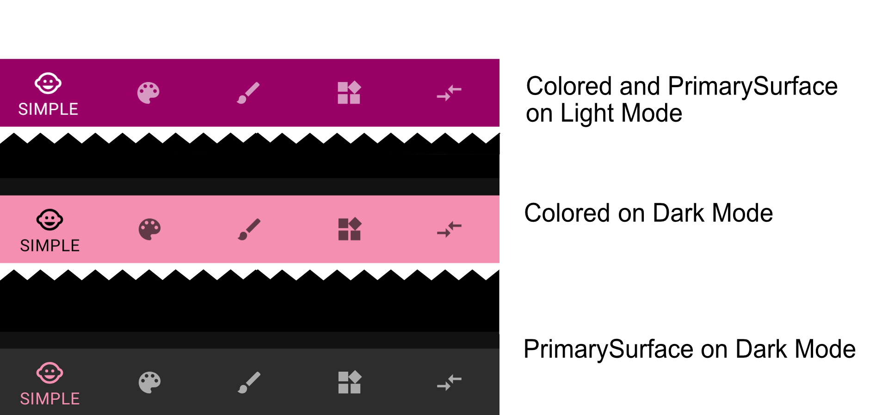

Companion App for the Article `Android App Theming: Colors` published in : [hugomatilla.com](hugomatilla.com/blog) You also can read it in the readme
<div style= "display: flex; flex-flow: row wrap; justify-content: space-between;">
    
    
    
    
    
    
</div>

# Android Design System and Theming: Colors
<!-- TOC -->

- [Android Design System and Theming: Colors](#android-design-system-and-theming-colors)
- [1. Introduction](#1-introduction)
- [2. Color naming](#2-color-naming)
- [3. Color theme attributes](#3-color-theme-attributes)
- [4. Update your theme with your colors](#4-update-your-theme-with-your-colors)
- [5. Widgets and default attributes.](#5-widgets-and-default-attributes)
- [6. I need more Themes](#6-i-need-more-themes)
- [7. What if 12 attributes are not enough?](#7-what-if-12-attributes-are-not-enough)
- [8. Extra](#8-extra)
- [9. Recap](#9-recap)
- [10. Conclusions](#10-conclusions)

<!-- /TOC -->
# 1. Introduction 
This is a continuation of the Article **CHANGE LINK** [Android Design System and Theming: Typography](https://github.com/HugoMatilla/Android-Design-System-and-Theming-Typography#android-design-system-and-theming-typography). In that article I explained why having a Style System help us to have a cohesive and easy to develop UI in our apps.
I used typography as a guide to explain the main concepts related to the **Android Application Theming**, the Android solution to have a Style System.

In this article, I will follow a similar structure, but now I will explain a much noticeable aspect of our apps: **Colors**.

<!-- Medium Remove Links to sections -->
* We will see first how to properly name colors in [2. Color naming](#2-color-naming)
* Then we will see the most important theme attribute for color [3. Color theme attributes](#3-color-theme-attributes) and how to apply them in our theme. [4. Update your theme with your colors](#4-update-your-theme-with-your-colors)
* After that, we will see how the widgets behave with the theme colors. [5. Widgets and default attributes.](#5-widgets-and-default-attributes)
* Later on, we will apply different themes to our app in [6. I need more Themes](#6-i-need-more-themes) and add custom theme attributes. [7. What if 12 attributes are not enough](#7-what-if-12-attributes-are-not-enough)
* And finally we will see some extra points in [8. Extra](#8-extra)

> [Material Design Documentation](https://material.io/develop/android) is being updated constantly. Some of the information here presented might be slightly different in new Material Design versions.

# 2. Color naming 
First of all, we have to select our colors. As far as in Android Studio 4.0.1 (In 4.1 is fixed﹡) if you create a new project with the empty activity wizard, the colors file looks like this.

```xml
<resources>
  <color name="colorPrimary">#6200EE</color>
  <color name="colorPrimaryDark">#3700B3</color>
  <color name="colorAccent">#03DAC5</color>
</resources>
```

We should change it.

As it is recommended the colors should have literal names (describe the value not how it's used). 
To help you with color naming you can use the [Material colors style](https://gist.github.com/HugoMatilla/fc24990505b9da2d081f7a7f87e3424e), use a tool like [name-that-color](https://chir.ag/projects/name-that-color/#D80E9E) or, a Plugin like [this one](https://plugins.jetbrains.com/plugin/10422-name-that-color).

I will use these.

```xml
<resources>
  <color name="brandPink">#990066</color>
  <color name="brandPinkDark">#66003c</color>
  <color name="brandGreen">#00CCAA</color>
  <color name="brandGreenDark">#02A287</color>
</resources>
```

Now that we have our colors  we have to set them in our theme attributes.
  
> ﹡In Android Studio 4.1, the *new project* wizard creates the colors with literal names.

> You can learn about theme attributes in my previous post in the section **CHANGE LINK** [Theme attributes in less than 100 words.](https://github.com/HugoMatilla/Android-Design-System-and-Theming-Typography/blob/master/readme.md#theme-attributes-vs-view-attributes-in-less-than-100-words)
 
# 3. Color theme attributes

An image is worth 1000 words.


Here we can see the 12 most important color attributes that the Material Design Library offers us.

```
colorPrimary
colorPrimaryVariant
colorOnPrimary

colorSecondary
colorSecondaryVariant
colorOnSecondary

android:colorBackground
colorOnBackground

colorSurface
colorOnSurface

colorError
colorOnError

```

> When creating your Theme you don't need to change all of them. Start changing only the Primary and Secondary and their cousins (`variant` and `on`). The rest of the attributes will, most of the time, do the job.

As you can see the color attributes are divided into some colors like `colorPrimary`, and in how should the foreground of that color be, like `colorOnPrimary`.


This is very helpful because we have now one place where we define our colors and also how the foreground of that color is, so we can be confident that there won't be visibility problems. Like if a dark-colored button has a dark-colored text.

> There is an intrinsic relation between `primary`, `variant` and `on`. If you change one of them you should verify that everything keeps looking good between each other.

You can read more about common theme attributes in the Google Developers Blog Post from Nick Butcher [Common Theme Attributes](https://medium.com/androiddevelopers/android-styling-common-theme-attributes-8f7c50c9eaba) 

# 4. Update your theme with your colors
Now that we have our colors set, let's apply them to our Theme.

First of all and in Android Studio 4.0.1 (In 4.1 is fixed﹡) the `Empty Activity` wizard creates  this style:
```xml
<resources>
  <!-- Base application theme. -->
  <style name="AppTheme" parent="Theme.AppCompat.Light.DarkActionBar">
    <!-- Customize your theme here. -->
    <item name="colorPrimary">@color/colorPrimary</item>
    <item name="colorPrimaryDark">@color/colorPrimaryDark</item>
    <item name="colorAccent">@color/colorAccent</item>
  </style>

</resources>
```

We will clean this up.

First, make the parent inherit from a Material Design theme. I will use `Theme.MaterialComponents.DayNight.DarkActionBar` 

> Don't forget to add the libray `com.google.android.material:material:<latest_version>` in your gradle module file.

Second, change the name to reflect that it is a theme. 

`values/themes.xml`
```xml
  <style name="Theme.MyApp" parent="Theme.MaterialComponents.DayNight.NoActionBar">
    <item name="colorPrimary">@color/brandPink</item>
    <item name="colorPrimaryVariant">@color/brandPinkDark</item>
    <item name="colorSecondary">@color/brandGreen</item>
    <item name="colorSecondaryVariant">@color/brandGreenDark</item>
  </style>
    
```
>  In section [8.1. Use a Base Theme](#81-use-a-base-theme) you can see a better approach when having a less simple themes hierarchy. 

Finally, move it to a `themes.xml` file.

> ﹡In Android Studio 4.1,  the *new project* wizard, the theme is already created in the `themes.xml` file.

## 4.1 Note about naming and files: 
### 4.1.1 Naming Styles
Because there is no XML tag `<theme>` we have to use the `<style>` tag for themes and styles indistinctly. Therefore to not getting confused with our design system, we need a convention to name them.

For Themes and Widget Styles the convention is:

 * Use `Theme.YourAppsName.ThemeVariantName` for the themes 
 * Use `Widget.YourAppsName.WidgetType.WidgetVariantName` for the widget 
 * Themes will be set for a `theme` in an XML.
 * Widgets will be set for a `style` in an XML.
 

```xml
<!-- We are using a Theme for a Style. (Bad) -->
<Button
  style="@style/Theme.MyApp.Button" 
/> 
<!-- We are using a Style for a Theme. (Also Bad) -->
<Button
  android:theme="@style/Widget.MyApp.Button.TextButton" 
/>
<!-- We should not do that, and proper naming will help us not to do it. -->
<!-- We use a Widget definition to define the widget style. And even if we normally won't set a theme in a widget, we set in this code the theme style with a Theme. (Good) -->
<Button
  style="@style/Widget.MyApp.Button.TextButton"
  android:theme="@style/Theme.MyApp.Button"
/>

```

With this, it is easy to see that we are not using themes when we should use styles, and vice versa.

### 4.1.2 Naming Files
* Add your themes in the `themes.xml` file
* Add your widget styles in the `styles.xml` file

Now if we run our app we can see how the colors are applied as we defined them in the theme.

# 5. Widgets and default attributes.
One of the main advantages of using theming is how easy they work with widgets.

You might be tempted to create a style for the buttons with your `attr/colorPrimary` and `attr/colorOnPrimary`. You don't need that.
```xml
  <style name="Widget.MyApp.Button">
    <item name="android:textColor">?attr/colorOnPrimary</item>
    <item name="backgroundTint">?attr/colorPrimary</item>
  </style>

  <Button
    style="@style/Widget.MyApp.Button"
    android:layout_width="wrap_content"
    android:layout_height="wrap_content"
  />
```

Android System and MD Library will do all for you. This will be shown equally.
The button content color is set to `colorPrimary` and `colorOnPrimary` for the text, so you don't have to do anything. 
```xml
  <Button
    android:layout_width="wrap_content"
    android:layout_height="wrap_content"
    />
```

The Material Design website has all the information about theme attributes so is very easy to understand and modify how they work.

Here is an extract of the Container Attributes of the [Contained button Component Docs](https://material.io/develop/android/components/buttons#contained-button)


The Material Design Library specifies different styles for the different components. 

For example, the `Button` widget has 3 different styles.
**Contained**, **Text**, and **Outlined**. These styles use theme attributes to define their look and feel. 
We can just change our theme attributes and set the specific Material Design style to accomplish a robust Design System in our app.


Check how the Contained Buttons does not need any specification to be painted with the theme colors, and how the others just need to set the style to a Material Design Library Style.

Note how the **Outlined Button** Style is set by a theme attribute called `materialButtonOutlinedStyle`. There is also a `borderlessButtonStyle` attribute for the **Text Button**, but as of today, [the official Material Docs](https://material.io/develop/android/components/buttons#text-button) shows the snippet above. 

> There are many other theme attributes defined in the MD library, and updates in the official documentation occur regularly. Is a good practice to review them while developing.

Android engineers recommend using Material Design Components. You can read more about it in this Android Developers post:: [We Recommend Material Design Components](https://medium.com/androiddevelopers/we-recommend-material-design-components-81e6d165c2dd)

There are a couple of places where this can be more complicated than it looks, but most of the time you won't have problems.

> Check the companion app to see how some widgets are painted just defining a theme and letting the Android and the default values do the rest.


## 5.1. Widget Customization 
In case you need to customize a widget, start from the Base Material Widget, and create a specific style for it. 

As mentioned before in [4.1.1 Naming Styles](#411-naming-styles), name the styles with the `Widget.` prefix as best practice.

```xml
<!-- res/styles.xml -->
<style name="Widget.MyApp.Button.MixedColors" parent="Widget.MaterialComponents.Button">
  <item name="android:textColor">?attr/colorPrimaryVariant</item>
  <item name="backgroundTint">?attr/colorSecondary</item>
</style>

<!-- Layout -->
<Button
  style="@style/Widget.MyApp.Button.MixedColors"
  android:layout_width="wrap_content"
  android:layout_height="wrap_content"
  android:text="Customized Button" />

```
## 5.2 Widget Customization with Widgets Theme Attributes
There are many theme-attributes related to Material Widgets, like `buttonStyle`, `appBarLayoutStyle` and `bottomNavigationStyle`. You can set these theme attributes in your theme to a specific style, and forget about setting the style in the view.

With this technic, we avoid adding styles directly in the view and reduce the risk of adding a wrong one.

```xml 
<!-- Style in the view -->
<com.google.android.material.bottomnavigation.BottomNavigationView
    ...     
    style="@style/Widget.MaterialComponents.BottomNavigationView.PrimarySurface"
>

--------------------------------------------------------------------------------------- 

<!-- Style in the theme using theme-attributes -->
<style name="Theme.MyApp" parent="Theme.MaterialComponents.DayNight.DarkActionBar">
    ...
    <item name="bottomNavigationStyle">@style/Widget.MaterialComponents.BottomNavigationView.PrimarySurface</item>
</style>

<com.google.android.material.bottomnavigation.BottomNavigationView
    ...     
    <!-- The view does not need to set the style. It is referenced automatically to the one in the Theme -->
>
```

# 6. I need more Themes
Your app might have different versions like Free and Premium and you want to have different looks between both. 
Another scenario is that your application uses different color schemes on different screens. In these cases, you can have more than one theme. 

Because your application has the theme set up in the manifest, to select a different one in an activity or fragment you will need to do it programmatically.

For an activity is as easy as calling `setTheme(R.style.yourTheme)` before calling `setContentView()`

```kotlin
override fun onCreate(savedInstanceState: Bundle?) {
    super.onCreate(savedInstanceState)
    setTheme(R.style.Theme_MyApp_Alternative) 
    setContentView(R.layout.activity_main)
}
```

In a fragment, setting the theme programmatically is done like this:
```kotlin
  override fun onCreateView(inflater: LayoutInflater, container: ViewGroup?, savedInstanceState: Bundle?): View? {
    val contextThemeWrapper = ContextThemeWrapper(activity, style.Theme_MyApp_Alternative)
    val localInflater = inflater.cloneInContext(contextThemeWrapper)
    return localInflater.inflate(R.layout.fragment_simple, container, false)
  }
```
Here you can find the official [*setTheme* documentation](https://developer.android.com/reference/android/content/Context.html#setTheme(int))

> Note 1: If you need to change your theme after views are instantiated you will need to call `recreate()` to inflate the views again with the new theme.

> Note 2: Notice how the dots are replaced with underscores when accessing the theme from the resources. `Theme.MyApp.Alternative` in the themes.xml will be  `Theme_MyApp_Alternative` in your Activity or Fragment.

> Check it live in the companion app: [ThemeAlternativeFragment.kt](https://github.com/HugoMatilla/Android-Design-System-and-Theming-Colors/blob/master/app/src/main/java/com/hugomatilla/android_theming_colors/ThemeAlternativeFragment.kt)


## 6.1. Theme Overlays
There are times that you need to change the theme but only in a fraction of your view hierarchy. For that, there is the Themes Overlays technic.
This topic was already covered in [my previous post](https://github.com/HugoMatilla/Android-Design-System-and-Theming-Typography#overlays). 

Here is an excerpt:
> In any of your views, you can add the `android:theme` attribute and set it to a specific theme. The view and all its children will use the new theme.
> ThemeOverlays inherit from an empty parent, should define as few attributes as possible, and its name should start with `ThemeOverlay`, thus it's clear its purpose.

```xml
// ThemeOverlay Style
<style name="ThemeOverlay.MyApp.Inverse" parent="">
  <item name="colorPrimary">@color/white</item>
  <item name="colorPrimaryVariant">@color/whiteDark</item>d
  <item name="colorOnPrimary">@color/brandPink</item>
  <item name="colorOnSurface">@color/white</item>
  <item name="colorSurface">@color/brandPinkDark</item>
  <item name="android:textColor">@color/white</item>
</style>

// Layout
<LinearLayout 
  ...
  android:theme="@style/ThemeOverlay.MyApp.Inverse">
  <LinearLayout
    ...
    android:background="?attr/colorSurface">
    
```

As you can see in the sample app I had to change the background in the layout `android:background="?attr/colorSurface"` so it gets the proper surface color in the background.
Also, I needed to change the text color in the style.

Depending on your necessities you will have to tweak little some attributes, but most of them will work properly.


<!--  -->

### 6.1.2 Premade overlays
The Material Design Library provides some premade overlays. Like `ThemeOverlay.MaterialComponents.Dark` Before you build your own, is good to check if some of them already comply with your requisites.

<!-- ### Theme overlays in default styles? 

When applying theme overlays in XML, there are two options to consider:
- `android:theme`: Works with all widgets, doesn’t work in default styles
- `app:materialThemeOverlay`: Only works with MDC widgets, works in default styles` -->

You can read more about theme overlays in the Google Developers Blog Post [Android Styling: themes overlay](https://medium.com/androiddevelopers/android-styling-themes-overlay-1ffd57745207)

# 7. What if 12 attributes are not enough?
One of the powers of theming is the ability to change the whole UI styles easily. Imagine this scenario: your app has 2 themes for normal and premium users.
The primary color is different for both, just creating a new theme with a different primary color and changing the theme for each of the user types will be sufficient.

Now imagine that our design team wants a specific FAB button color for the premium members, which is not the same as the premium secondary color. In this case and because FAB buttons use `colorSecondary` attribute to tint it, we need a solution.

We can define a custom theme attribute that will be used to tint the fab buttons, instead of the default attribute (in this case `colorSecondary`).

```xml
<!-- res/values/attrs.xml -->
<attr name="fabBackgroundColor" format="color" />

<!-- res/values/themes.xml -->
<style name="Theme.MyApp.Default" parent="Theme.MyApp">
    ...
    <item name="fabBackgroundColor">?attr/colorSecondary</item>
</style>

<style name="Theme.MyApp.Alternative" parent="Theme.MyApp">
    ...
    <item name="fabBackgroundColor">@color/orangePremium</item>
</style>

<!-- res/values/styles.xml -->
<style name="Widget.MyApp.ExtendedFloatingActionButton" parent="Widget.MaterialComponents.ExtendedFloatingActionButton">
    <item name="backgroundTint">?attr/fabBackgroundColor</item> 
</style>

<!-- Layout -->
<com.google.android.material.floatingactionbutton.ExtendedFloatingActionButton
  ...
  style="@style/Widget.MyApp.ExtendedFloatingActionButton"
  />

```


You can see in the images above how the `EXTENDED FAB` is colored as a default Fab Button using the secondary color on both screens. But for the `CUSTOM ATTRIBUTE` button, it used the secondary color (default behavior) in the base theme (left), but it uses the `orangePremium` color, set in the theme attribute `fabBackgroundColor` for the alternative theme(right).

> You can check it in the companion app tab: **Alt.Theme** 

# 8. Extra

## 8.1. Use a Base Theme
It is a good practice to have a Base Theme where you add things that won't change for any theme, like text appearances, shapes or widgets default styles, and create specific themes inheriting from it.

```xml
  <style name="Theme.MyApp" parent="Theme.MaterialComponents.DayNight.DarkActionBar">
    <item name="textAppearanceBody1">@style/TextAppearance.MyApp.Body1</item>
    <item name="bottomNavigationStyle">@style/Widget.MaterialComponents.BottomNavigationView.PrimarySurface</item>
    ...
  </style>

  <style name="Theme.MyApp.Default" parent="Theme.MyApp">
    <item name="colorPrimary">@color/brandPink</item>
    ...
  </style>

  <style name="Theme.MyApp.Alternative" parent="Theme.MyApp">
    <item name="colorPrimary">@color/brandVioletPremium</item>
    ...
  </style>
```

## 8.2. Dark Theme
Dark Theme is a big topic that will fit best in a different post. But to give it a try in your app you can do these simple steps:

* First create a file in `res/values-night` and call it `theme.xml`
* Secondly, create a theme with the same name as your primary theme name (the one you set in the manifest). You can simply copy and paste it. 
* Third, change the basic colors for the Dark Mode. To start, use the same ones you have in the light theme but with lower saturation.  
* And finally, copy and paste this code to add a button to toggle the Dark Mode in your app. 

```kotlin
  private fun addDarkModeButton() {
    val darkButton =
      Button(this).apply {
        text = "Dark Mode Toggle"
        layoutParams = LayoutParams(MATCH_PARENT, WRAP_CONTENT)
      }

    (window.decorView as ViewGroup).addView(darkButton) // or `yourContainer.addView(darkButton)`

    darkButton.setOnClickListener {
      val goDark = getDefaultNightMode() != MODE_NIGHT_YES
      AppCompatDelegate.setDefaultNightMode(if (goDark) MODE_NIGHT_YES else MODE_NIGHT_NO)
    }
  }  
```
> The important part is the one inside the `setOnClickListener` The rest is to give a plug&play option.

Now you can see your app in dark mode with the default values. 

There is much more to talk about Dark Themes but this post is already big enough. Let's do it in another one. 

## 8.3. PrimarySurface
`colorPrimarySurface` is a theme attribute (and a variant of some styles) that helps while working with surfaces in Dark Mode.

Several colored widget surfaces are set to the primary color. Like the **Toolbar** or **Bottombar**, but in case we change the theme to a Dark Theme, the primary color as the surface color does not look appropriate.
 
For these cases there are `colorPrimarySurface` and `colorPrimaryOnSurface`. Widgets can use these attributes as backgroundTints so in Light Theme the primary color will be used, but in Dark Themes a dark surface color will be selected.

We can see this behavior in the **BottomBar** style.
In the companion app,the **BottomBar** style is  `Widget.MaterialComponents.BottomNavigationView.PrimarySurface`. When we turn on the Dark Mode the **BottomBar** will be colored as dark grey. 

If we instead used `Widget.MaterialComponents.BottomNavigationView.Colored` when the Dark Mode is turned on, the **BottomBar** will be colored as primary. 

```xml
<com.google.android.material.bottomnavigation.BottomNavigationView
    ...     
    style="@style/Widget.MaterialComponents.BottomNavigationView.PrimarySurface"
    or
    style="@style/Widget.MaterialComponents.BottomNavigationView.Colored"
>
```


<!--  -->

# 9. Recap
There are only 4 steps to have your app theme up and running.

1. Add your primary and secondary colors to your `colors.xml` file.  (Use literal names)
2. Create your theme in the `themes.xml` file and reference it in your manifest.
3. Reference the main color theme attributes (`primaryColor`, `primaryVariantColor`, `secondaryColor`... )to your preferred ones. 
4. Use the Material Design Widgets in your layouts, and adapt them using `styles` in case you need specific customization.

# 10. Conclusions

Android Theming is a powerful technic that can help us to have a cohesive UI and speed up our development. 

The topic is big, and there are many things to learn, but to have a base theme is straight forward and as you saw in the recap section there are only 4 easy steps.  (In Android Studio 4.1 the first 3 steps are already done in new projects)

If you haven't yet, you can check my previous article  [Android Design System and Theming: Typography](https://github.com/HugoMatilla/Android-Design-System-and-Theming-Typography#android-design-system-and-theming-typography). And as I mentioned there, the general topics here presented can be applied also to text appearances and shapes.

Before saying goodbye I recommend you checking this Android Dev Summit talk [Developing Themes with Style](https://www.youtube.com/watch?v=Owkf8DhAOSo) by [Nick Butcher](https://twitter.com/crafty) and [Chris Banes](https://twitter.com/chrisbanes). There are also several [posts in Android Developers Medium](https://medium.com/androiddevelopers/tagged/design) by the Android Design Team covering all topics about theming and styling.

Finally, I hope this article helps you to understand Android Theming and Styling a bit better.

Thank you for reading.

PS: Thanks to @naufalaros for reviewing the article 😉
